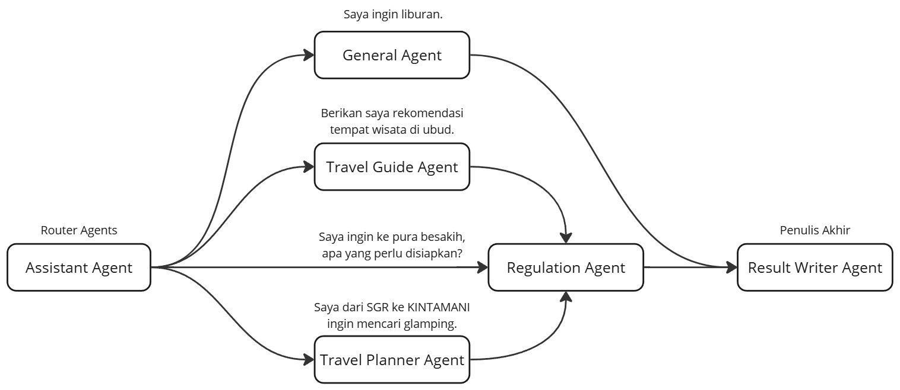

# MLALI AGENTS

## Ringkasan


Mlali Agents adalah virtual assistant berbasis teknologi Retrieval-Augmented Generation (RAG) yang dirancang untuk membantu dalam aktivitas perjalanan wisata. Mlali Agents memiliki kemampuan untuk memberikan informasi perjalanan ke tempat wisata dan perencanaan untuk melakukan liburan. Hanya dengan satu platform, kini dapat memperoleh solusi cepat dan efisien dalam memenuhi kebutuhan informasi untuk berwisata.

## Instalasi Project

Clone project

```bash
  git clone https://git.undiksha.ac.id/riset/mlali-agents.git
```

Masuk ke direktori project

```bash
  cd mlali-agents
```

Buat virtual environment

```bash
  pip install virtualenv
  python -m venv venv
  venv/Scripts/activate     # windows
  source venv/bin/activate  # macOS atau linux
```

Install requirements

```bash
  pip install -r requirements.txt
```

Buat dan Lengkapi file environment variabel (.env)

```bash
  OPENAI_API_KEY="YOUR_OPENAI_API_KEY"
  VA_BEARER_TOKEN="YOUR_VA_BEARER_TOKEN"
```

Jalankan dengan Web Streamlit (Frontpage: `/`)

```bash
  streamlit run streamlit.py --server.port XXXX
```

atau

Jalankan dengan API (Dokumentasi: `/docs`, Spesifikasi: `/openapimlali.json`, Help: `/help`)

```bash
  uvicorn api:app --host 0.0.0.0 --port XXXX --workers X
```

Atau

Jalankan dengan CLI di Terminal

```bash
  # Tambahkan baris kode ini pada baris terakhir file main.py:
  runModel("Ketik pertanyaan disini")

  # Jalankan di terminal:
  python main.py
```

Contoh pertanyaan dapat dilihat disini: [example_question.txt](public/example_question.txt)

## Referensi

1. [Build a ChatBot Using Local LLM](https://datasciencenerd.us/build-a-chatbot-using-local-llm-6b8dbb0ca514)
2. [Best Practices in Retrieval Augmented Generation](https://gradientflow.substack.com/p/best-practices-in-retrieval-augmented)
3. [Simplest Method to improve RAG pipeline: Re-Ranking](https://medium.com/etoai/simplest-method-to-improve-rag-pipeline-re-ranking-cf6eaec6d544)
4. [The What and How of RAG(Retrieval Augmented Generation) Implementation Using Langchain](https://srinivas-mahakud.medium.com/the-what-and-how-of-retrieval-augmented-generation-8e4a05c08a50)
5. [Retrieval-Augmented Generation (RAG): From Theory to LangChain Implementation](https://towardsdatascience.com/retrieval-augmented-generation-rag-from-theory-to-langchain-implementation-4e9bd5f6a4f2)
6. [RAG - PDF Q&A Using Llama 2 in 8 Steps](https://medium.com/@Sanjjushri/rag-pdf-q-a-using-llama-2-in-8-steps-021a7dbe26e1)
7. [RAG + Langchain Python Project: Easy AI/Chat For Your Docs](https://youtu.be/tcqEUSNCn8I)
8. [Python RAG Tutorial (with Local LLMs): Al For Your PDFs](https://youtu.be/2TJxpyO3ei4)
9. [A Survey of Techniques for Maximizing LLM Performance](https://youtu.be/ahnGLM-RC1Y)
10. [18 Lessons teaching everything you need to know to start building Generative AI applications](https://microsoft.github.io/generative-ai-for-beginners/#/)
11. [How to build a PDF chatbot with Langchain 🦜🔗 and FAISS](https://kevincoder.co.za/how-to-build-a-pdf-chatbot-with-langchain-and-faiss)
12. [How to Enhance Conversational Agents with Memory in Lang Chain](https://heartbeat.comet.ml/how-to-enhance-conversational-agents-with-memory-in-lang-chain-6aadd335b621)
13. [Memory in LLMChain](https://python.langchain.com/v0.1/docs/modules/memory/adding_memory/)
14. [RunnableWithMessageHistory](https://api.python.langchain.com/en/latest/runnables/langchain_core.runnables.history.RunnableWithMessageHistory.html#langchain_core.runnables.history.RunnableWithMessageHistory)
15. [Why Assistants API is Slow? Any speed solution?](https://community.openai.com/t/why-assistants-api-is-slow-any-speed-solution/558065)
16. [OpenAI API is extremely slow](https://github.com/langchain-ai/langchain/issues/11836)
17. [Adaptive RAG](https://langchain-ai.github.io/langgraph/tutorials/rag/langgraph_adaptive_rag/)
18. [Hands-On LangChain for LLMs App: ChatBots Memory](https://pub.towardsai.net/hands-on-langchain-for-llms-app-chatbots-memory-9394030e5a9e)
19. [How to Make LLM Remember Conversation with Langchain](https://medium.com/@vinayakdeshpande111/how-to-make-llm-remember-conversation-with-langchain-924083079d95)
20. [Conversation Summary Buffer](https://python.langchain.com/v0.1/docs/modules/memory/types/summary_buffer/)
21. [From Basics to Advanced: Exploring LangGraph](https://towardsdatascience.com/from-basics-to-advanced-exploring-langgraph-e8c1cf4db787)
22. [Build a Reliable RAG Agent using LangGraph](https://medium.com/the-ai-forum/build-a-reliable-rag-agent-using-langgraph-2694d55995cd)
23. [LangGraph](https://langchain-ai.github.io/langgraph/)
24. [Steps In Evaluating Retrieval Augmented Generation (RAG) Pipelines](https://cobusgreyling.medium.com/steps-in-evaluating-retrieval-augmented-generation-rag-pipelines-7d4b393e62b3)
25. [RAG Evaluation](https://cobusgreyling.medium.com/rag-evaluation-9813a931b3d4)
26. [Evaluating RAG Applications with RAGAs](https://towardsdatascience.com/evaluating-rag-applications-with-ragas-81d67b0ee31a)
27. [RAGAS for RAG in LLMs: A Comprehensive Guide to Evaluation Metrics](https://dkaarthick.medium.com/ragas-for-rag-in-llms-a-comprehensive-guide-to-evaluation-metrics-3aca142d6e38)
28. [Advanced RAG Techniques: What They Are & How to Use Them](https://www.falkordb.com/blog/advanced-rag/)
29. [Visualize your RAG Data - Evaluate your Retrieval-Augmented Generation System with Ragas](https://towardsdatascience.com/visualize-your-rag-data-evaluate-your-retrieval-augmented-generation-system-with-ragas-fc2486308557/)
30. [Visualize your RAG Data — EDA for Retrieval-Augmented Generation](https://itnext.io/visualize-your-rag-data-eda-for-retrieval-augmented-generation-0701ee98768f)
